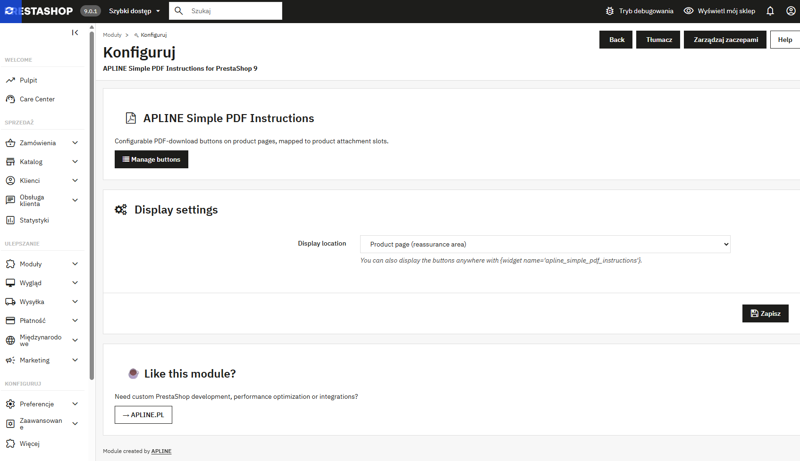
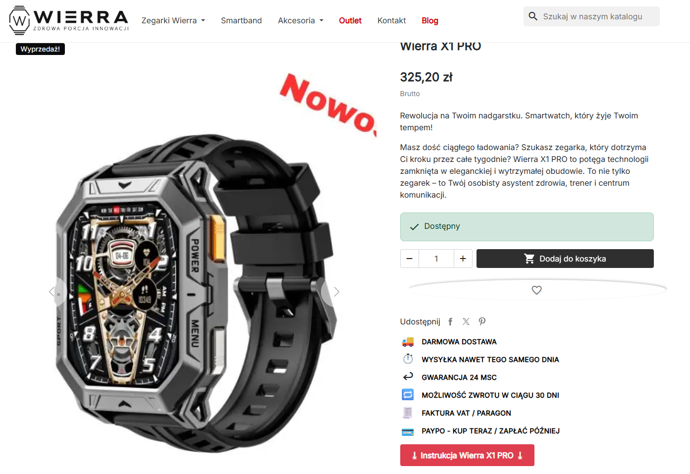

# APLINE Simple PDF Instructions for PrestaShop 9

A lightweight, distributable PrestaShop **9.0.x** module that displays
configurable **PDF-download buttons** on the product page. Each button
is mapped to a **product-attachment slot** (1st attachment, 2nd
attachment, … up to 10th). The module reads native PrestaShop
attachments — it does **not** manage PDF files itself. Buttons without
a matching attachment are silently skipped, so the same global
configuration works across your entire catalogue.

> Created by **[APLINE](https://apline.pl)** — custom PrestaShop
> development, performance optimization and integrations.

---

## ✨ Features

- ✅ Configurable PDF-download buttons mapped to product **attachment
  slots** (1st, 2nd, …, 10th attachment)
- ✅ **Graceful skip** — a button without a matching attachment on the
  current product is silently omitted (no empty links, no errors)
- ✅ Per-button **icon image** (JPG/PNG/WEBP upload) **or** **icon
  entity** (unicode hex / HTML entity), with position none / left /
  right / both
- ✅ Per-button **label source**:
  - **Custom text** — your own label, optionally with the product name
    appended
  - **Attachment file name** — the title set on the attachment in
    Catalog → Files, without extension (fallback: storage file name)
- ✅ Per-button **background color** (hex picker), **drag & drop**
  ordering, enable/disable per button
- ✅ Configurable display location: product reassurance area, left or
  right column, product footer — or anywhere via
  `{widget name='apline_simple_pdf_instructions'}`
- ✅ Strict, English-only validation:
  - slot range 1–10, hex color, icon-entity whitelist
  - required fields, 255-char limit (rejected, never silently
    truncated)
  - image upload hardened: **JPG / PNG / WEBP only**, real MIME
    inspection (not just the extension), **2 MB** size cap → blocks
    disguised executables
  - **Remove current image** switch on edit, so you don't have to
    delete the whole button to clear an icon
- ✅ **Crash-safe**: a rendering/data error yields an empty block,
  never a 500; a failed install rolls back to a clean state
- ✅ No DRM, no telemetry
- ✅ Public GitHub, custom attribution license, modifiable
- ✅ Released for **PrestaShop 9**

## 📦 Requirements

- PrestaShop **9.0.x** (tested on 9.0; not supported on 1.7 / 8.x —
  the module's `ps_versions_compliancy` blocks installation outside
  9.0.x)
- PHP compatible with your PrestaShop 9 install
- Writable `views/img/` directory (for icon uploads)
- Product attachments configured in *Catalog → Files* and assigned to
  products in the product edit page (*Files* tab) — this module
  consumes attachments, it doesn't create them

> Always test on a staging copy of your shop before installing on
> production. The module is crash-safe by design (a render error
> yields an empty block, never a 500), but every shop's theme and
> module mix is different.

## 🚀 Installation

**Via Back Office**

1. Download `apline_simple_pdf_instructions.zip` from the
   *Releases* page on GitHub. The archive contains the
   `apline_simple_pdf_instructions/` folder at its root with
   forward-slash paths. The folder name, the main `.php` file name
   and the PHP class name MUST all be `apline_simple_pdf_instructions`
   — otherwise PrestaShop refuses the zip with "This file doesn't
   seem to be a valid zip module".
2. *Modules → Module Manager → Upload a module* → select the ZIP →
   install.

**Via FTP**

1. Upload the `apline_simple_pdf_instructions/` folder to `modules/`.
2. *Modules* → find **APLINE Simple PDF Instructions for
   PrestaShop 9** → Install.

No demo data is created on install — buttons without matching
attachments would be "ghost buttons" on every product. Add your first
button via *Configure → Manage buttons*.

## 🧹 Uninstall

**From Back Office** (recommended): *Modules → Module Manager → find
**APLINE Simple PDF Instructions for PrestaShop 9** → Uninstall*.

Uninstall is **destructive and idempotent**:

- the `ps_aspd_button` table is dropped — all button definitions are
  deleted
- all uploaded icons in `views/img/aspd_*` are removed from disk
- the `ASPD_HOOK` configuration entry is removed
- the hidden admin tab (`AdminAplineSimplePdfInstructionsButton`) is
  removed
- module hook registrations are unregistered

**Product attachments are NOT touched** — this module never owned
them, they live in PrestaShop's native `ps_attachment` /
`ps_product_attachment` tables.

If you want to keep your button definitions, **back up the
`ps_aspd_button` table and the `views/img/` folder before
uninstalling**. There is no built-in export.

Deleting the `apline_simple_pdf_instructions/` folder via FTP without
running the BO Uninstall first leaves orphan rows in `ps_configuration`,
`ps_tab`, `ps_hook_module` and the `ps_aspd_button` table behind —
clean those manually if you go that route.

## ⚙️ Usage

### 1. Prepare your attachments

In *Catalog → Files*, add the PDF files you want to serve (instruction
manuals, datasheets, certificates, etc.). Each file gets a *Name*
which can become the button label (see *Label source* below). Then
edit each product (*Catalog → Products → Files* tab) and assign the
attachments. The **order** of attachments per product defines which
button slot they fill (1st assigned attachment = slot 1, 2nd = slot
2, etc.).

### 2. Configure the module

*Modules* → configure **APLINE Simple PDF Instructions for
PrestaShop 9**. Pick the **display location** (default: *Product page
(reassurance area)*).

### 3. Add buttons

Click **Manage buttons** → *Add new button*. For each button:

- **Attachment slot** (1–10) — which attachment slot this button
  represents
- **Icon image** (optional) and **Icon entity** (optional, e.g.
  `1F4C4` for 📄), with **Icon position** none / left / right / both
- **Label source**:
  - *Custom text* — set **Own label text** and/or **Append product
    name**
  - *Attachment file name* — uses the per-language *Name* from the
    attachment in Catalog → Files
- **Button color** (hex picker, default `#dc3545`)
- **Displayed** switch

Reorder buttons by drag & drop. The visual order of buttons in the
list is the order they appear on the front-end.

### 4. Embed elsewhere (optional)

```smarty
{widget name='apline_simple_pdf_instructions'}
```

Drop this anywhere in your theme to render the buttons for the current
product context, regardless of the configured hook.

## 🖼️ Screenshots

**Module configuration page** — pick the display location:



**Buttons management** — drag & drop ordering, enable/disable, label
source picker, remove-current-image switch:


**Front-end** — the rendered buttons on the product page:



## 🛠️ Troubleshooting

### "This file doesn't seem to be a valid zip module"

PrestaShop's installer requires that the **folder name**, the **main
`.php` file name** and the **PHP class name** all match — and the zip
must contain that folder at its root with **forward-slash** paths.

- Re-download the official zip from the GitHub repository's
  *Releases* page; do not rezip the source folder with Windows
  Explorer (it sometimes writes `\` separators that PrestaShop
  rejects).
- If you must rebuild the zip yourself, on PowerShell 5.1 avoid
  `Compress-Archive` — see the build recipe in [CLAUDE.md](CLAUDE.md).

### Buttons do not appear on the product page

- Most common cause: the product has **no attachment in the slot the
  button is configured for**. Open the product, *Files* tab, confirm
  the expected attachment is assigned and that its order matches the
  slot number.
- *Modules → APLINE Simple PDF Instructions → Configure* — make sure
  the **Display location** dropdown is set to where you expect
  (default: *Product page (reassurance area)*).
- Make sure the button has the **Displayed** switch on.
- Some themes strip the `displayProductAdditionalInfo` hook. Try
  *Left column* or *Product page footer* instead, or embed the block
  manually with `{widget name='apline_simple_pdf_instructions'}` in
  your theme template.
- Clear the PrestaShop cache (*Advanced Parameters → Performance →
  Clear cache*).

### Icon upload fails / silent rejection

- The upload folder `modules/apline_simple_pdf_instructions/views/img/`
  must be writable by PHP. A red warning on the configuration page
  signals it is not — fix the permissions (`chmod 0775` on Linux).
- Only **JPG / PNG / WEBP** files up to **2 MB** are accepted. The
  module inspects the real file content, not just the extension —
  renamed executables will be rejected as "not a valid image".
- To clear an existing icon without uploading a new one, toggle
  **Remove current image** on the edit form and save.

If none of the above explains your issue, open a GitHub Issue with
your PrestaShop version, PHP version, theme name, and the relevant
lines from `var/logs/`.

## 📝 License

Custom Attribution License v1.0 — see [LICENSE.md](LICENSE.md).

You may use, modify, distribute and ship this module commercially and
in client projects. You may **not** remove or hide the APLINE
attribution link on the module configuration page. The attribution
must stay visible, link to <https://apline.pl>, and use a readable
font size (≥ 12px).

## 🏢 About APLINE

Need custom PrestaShop development, performance optimization or
integrations?

→ **[APLINE.PL](https://apline.pl)**
